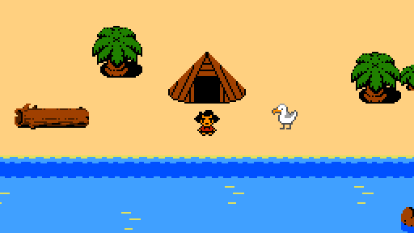

# Vegan on a Desert Island

[](https://riot.im/app/#/room/#voadi:matrix.org)
<a rel="me" href="https://mastodon.gamedev.place/@voadi"></a>
[](https://liberapay.com/voadi/donate)



*Vegan on a Desert Island* is a work-in-progress 2D top-down adventure game for Linux, MacOS and Windows.

Inspired by the pervasive question “what would vegans do if stranded on a desert island?” *Vegan on a Desert Island* seeks to provide an answer.
Learn more at [voadi.com](http://voadi.com/).

# Running the game

1. Download and install [Solarus](https://www.solarus-games.org/en/solarus/download).
2. Download [VOADI](https://gitlab.com/voadi/voadi/-/archive/master/voadi-master.zip) and extract the ZIP somewhere. **Note:** this is the current development version which is incomplete and changes very often.
3. Open Solarus Quest Editor and click "File > Load Quest..." and select the directory you extracted earlier.
4. Click the blue play button at the top.
5. That's it!

For more detailed instructions on each platform, see [*Running the Game*](https://gitlab.com/voadi/voadi/wikis/running-the-game).

## Git hooks

You can enable git hooks for useful automation, such as automatically compressing graphics on commit.

```sh
rm -rf .git/hooks && ln -s ../git-hooks .git/hooks
```

# License


Vegan on a Desert Island is Free Software, licensed under GPL-3.0.
See the `LICENSE` file included in this repo for a copy of the full license.

Game assets are licensed under a Free Culture Approved Creative Commons license.
See [*Credits*](https://gitlab.com/voadi/voadi/wikis/credits) for a working list of attributions.
